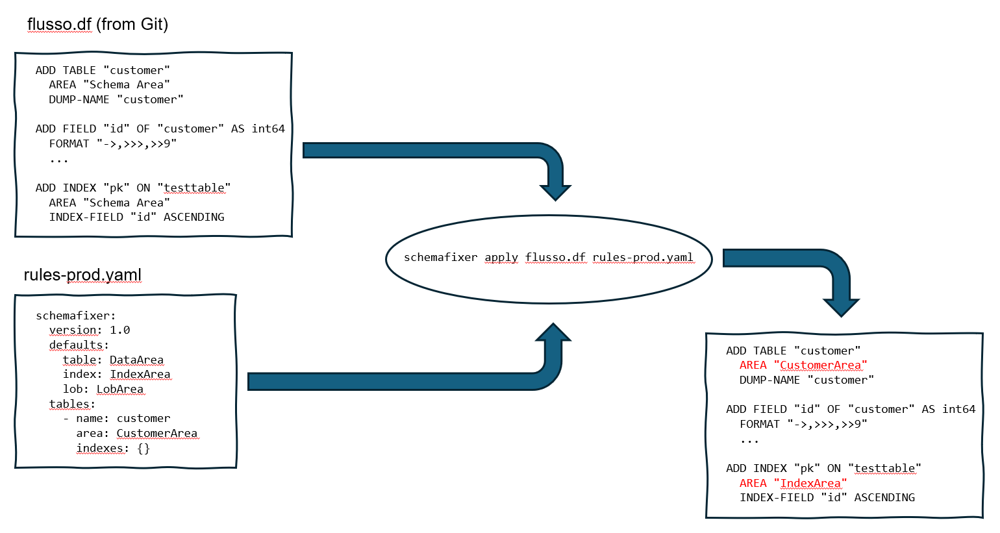

# `schemafixer`

## apply 
Schema fixer is a tool for making it possible to fix schema areas between a git repo and the actual environments.
For example, the .df in git puts all table/index/lob in the `Schema Area`, whereas in production these are in dedicated storage areas.

So imagine you have a `sports2020.df` in git where everything is in the `Schema Area`. Provide the following rules (in `rules.yaml`):
```
schemafixer:
  version: 1.0
  defaults:
    table: DataArea
    index: IndexArea
    lob: LobArea
  tables:
    - name: customer
      area: data
      indexes:
        custnum: index1
        comments: idx2
    - name: item
      area: data
      indexes:
        itemid: index1
      lobs:
        ItemImage: lob1
```
and execute:
`schemafixer apply sports2020.df rules.yaml`. This will replace all areas for which no specific rules are specified with the default value from the rules. So, the `customer` and `item` table are put in the `data` area, the rest in `DataArea`, based on above rule. 
The `item.itemid` index goes in area `index1` etc...



The idea is that this way it's possible to have different areas for various environment with the need to keep track of them in the .df in your source control.

## parse
Suppose you have an existing production schema and you don't want to hand type all the rules. This is where the `parse` command comes in handy.
Suppose a lot of tables etc go into default areas and you want to record the exceptions, use the `parse` command:
`schemafixer parse sports2020.df default.yaml` where the latter contains:
```
schemafixer:
  version: 1.0
  defaults:
    table: DataArea
    index: IndexArea
    lob: LobArea
```
This will result in a new rules file based on the existing schema.

## diff
The `diff` command compares two .df's and displays the differences:
`schemafixer diff sports2020.df sports2020-prd.df`

An example output is:
```
CONSTRUCT       NAME              SOURCE AREA     TARGET AREA
TABLE           Customer          Data Area        CustomerArea
INDEX           Customer.CustNum  Index Area       CustIndexArea
LOB             Item.ItemImage    LOB Area         ImageArea
```

or another example where `benefits` is not available in the target schema:
```
CONSTRUCT  NAME            SOURCE AREA  TARGET AREA
---------  --------------  -----------  -----------
TABLE      Benefits        Data Area    (not present)
INDEX      Benefits.EmpNo  Index Area   (not present)
TABLE      BillTo          Data Area    DataArea
```

## docker
The `schemafixer` is wrapped in a container image and is available at `docker.io/devbfvio/schemafixer`.
Example:
```
docker run -v .:/src devbfvio/schemafixer apply sports2020.df rules-prod.yaml -o sports2020-prod.df
```
Note: the `WORKDIR` is `/src`. So, assuming `sports2020.df` and `rules-prod.yaml` are in the current directory, the `-v .:/src` is essential to make this work. 
